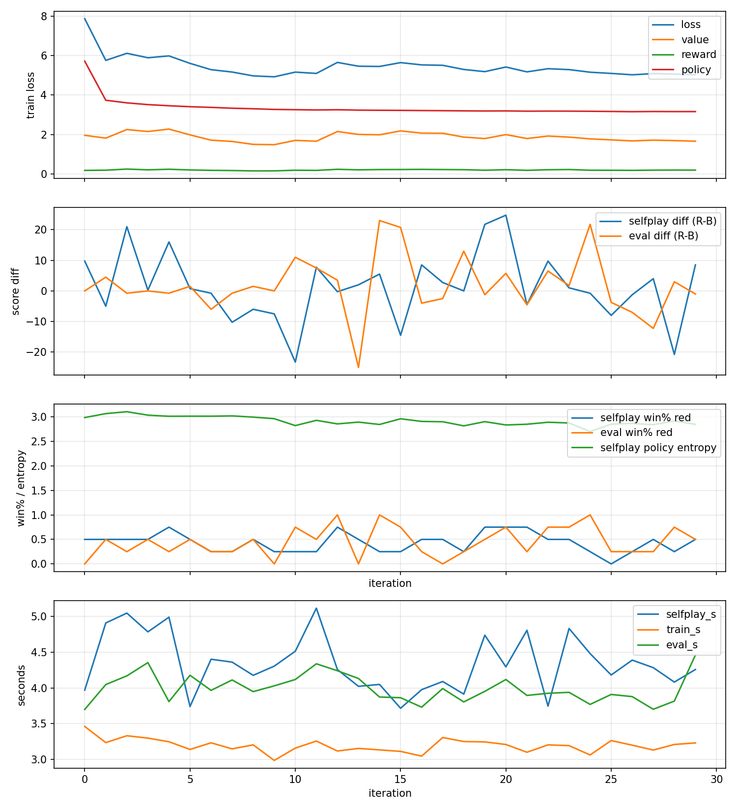

# rebuilt-muzero

A MuZero-style **macro decision coach** for the FIRST Robotics 2026 game,
**REBUILT**. Instead of controlling a joystick, the agent picks high-level
plays — *collect from this bin*, *score the HUB now*, *defend the opponent's
collector*, *prep climb* — once per second, for a 3v3 alliance.

The repo contains:

- A fast macro simulator of a REBUILT match (no kinematics; everything is
  modelled as timed macros so we can do MuZero self-play on a laptop).
- A turn-based two-player wrapper around the simulator.
- A small but complete MuZero implementation (representation / dynamics /
  prediction networks, batched PUCT MCTS over a top-K joint action space,
  replay buffer with bootstrap targets, training CLI).
- A matplotlib debug renderer for the simulator.
- A calibration harness that compares the macro sim's throughput sensitivity
  against an external cycle-time dataset.

This is not a control system and not a driver-station tool. It's a research /
strategy-analysis project.

## Quick start

```bash
pip install -e ".[train]"

# Sanity check: the macro sim runs ~thousands of matches/s on a laptop
python scripts/benchmark_macro_sim.py --matches 1000

# Watch a scripted policy
python scripts/visualize_macro_sim.py --policy greedy

# Smoke-test the training loop
python scripts/train_muzero.py --preset fast --iterations 5 --min-replay-games 2

# Real training run (auto-picks cuda > mps > cpu)
python scripts/train_muzero.py --preset medium --iterations 50
```

`pip install -e .` (without `[train]`) installs only the simulator — useful if
you just want to experiment with macro environments or write your own agent.

## Repository layout

```
rebuilt_muzero/
  sim/            # macro simulator
    actions.py        # discrete action space + encoding
    config.py         # GameConfig, RobotSpec, defaults
    env.py            # RebuiltMacroSim (the core env)
    gymnasium_env.py  # optional Gymnasium wrapper
    render.py         # matplotlib debug renderer
    state.py          # SimState + region helpers
  muzero/         # two-player MuZero on top of the sim
    config.py         # MuZeroConfig
    game.py           # turn-based wrapper
    joint_action.py   # encode/decode (a0,a1,a2) <-> int
    mcts.py           # batched PUCT MCTS
    networks.py       # h/g/f MLPs
    obs_encoder.py    # canonical (current-player) obs
    replay.py         # game histories + sampling
    selfplay.py       # play one MuZero self-play game
    train.py          # one optimizer step
scripts/        # CLI entry points (see docs)
data/           # massive_results.json — calibration dataset
docs/           # design, muzero, calibration, visualization
```

## Modelling at a glance

REBUILT in this repo:

- **Phases**: AUTO 20s → TRANSITION 10s → 4 × Alliance Shifts (25s each) →
  ENDGAME 30s. During each Alliance Shift only one alliance's HUB is active.
- **Scoring**: 1 point per FUEL into an active HUB; tower scoring by climb
  level (different in AUTO vs TELEOP/ENDGAME); penalties for scoring outside
  your zone, pinning, and endgame tower contact.
- **State**: 8 coarse neutral-fuel bins, depot/outpost storage, per-robot
  region + carried fuel + busy timers + climb state, alliance shift order
  determined by AUTO fuel.
- **Actions** (per robot): `COLLECT_NEUTRAL(bin)`, `COLLECT_DEPOT`,
  `SCORE_HUB`, `DELIVER_OUTPOST`, `DEFEND_OPPONENT_*`, `PREP_CLIMB(level)`,
  `CLIMB(level)`, `IDLE`. The MuZero wrapper combines 3 robots into a single
  joint action (`per_robot ** 3` ≈ 8000 by default) and uses top-K policy
  expansion in MCTS.

See [docs/design.md](docs/design.md) for the full design notes.

## Documentation

- [docs/design.md](docs/design.md) — design rationale and modelling choices
- [docs/muzero.md](docs/muzero.md) — MuZero stack, CLI knobs, code layout
- [docs/calibration.md](docs/calibration.md) — calibration dataset and harness
- [docs/visualization.md](docs/visualization.md) — debug renderer

## Status

The simulator and MuZero stack both work end-to-end. The macro sim runs
hundreds of full matches per second on a laptop (see
`scripts/benchmark_macro_sim.py`). Training has been verified on CPU, MPS,
and CUDA — losses come down, policy entropy collapses as the policy
sharpens, and the trained agent beats random play in eval.



*30 iterations of `--preset medium` on an RTX 4080 SUPER (~6 minutes, 120
self-play games). Top to bottom: train losses, score-diff (R−B) on self-play
+ greedy eval, win-rate + policy entropy, per-iteration time breakdown.*

Trained checkpoints are not bundled in the repo — re-run training locally
to produce them; they land under `.tmp/muzero/`.

The real-time drive-coach UI sketched in `docs/design.md` is not
implemented; this repo is the simulator + agent only.

## License

MIT — see [LICENSE](LICENSE).

FIRST, FRC, and the REBUILT game are trademarks of *FIRST*. This project is
not affiliated with or endorsed by *FIRST*.
